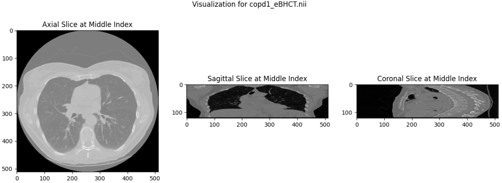
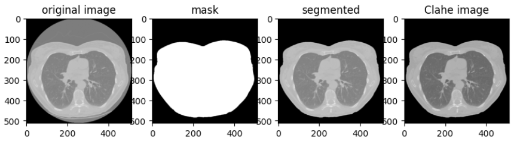
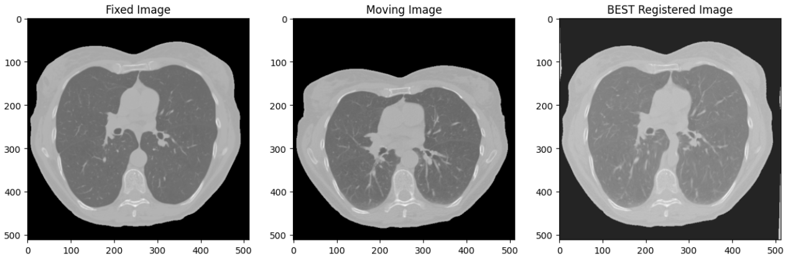
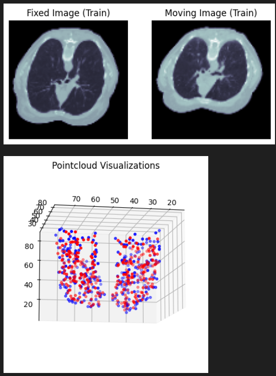
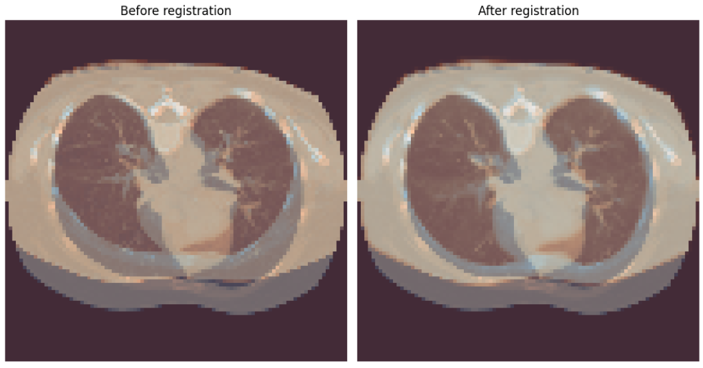
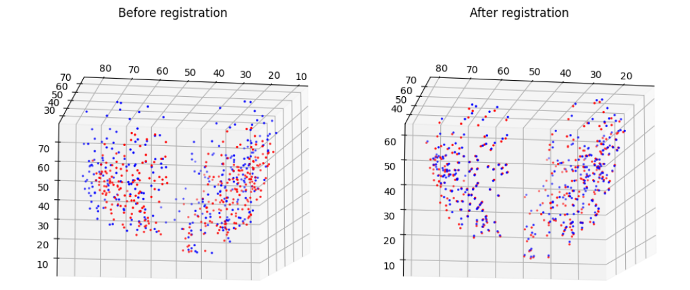

# Lung 4DCT Image Registration

This repository contain the code for the registration of  inhale and exhale lung CT scans from the DIR Lab COPDGene dataset. The registration methods implemented include Elastix and Transformix, an intensity based image registration algorithm, and compared its performance with several pre-trained deep learning algorithms from Monai (SegResNet, Vnet, Autoencoder, and HighResNet).

## DATASET
The dataset is the DIR Lab [COPDGene dataset](https://med.emory.edu/departments/radiation-oncology/research-laboratories/deformable-image-registration/downloads-and-reference-data/index.html), consisting of 10 pairs of lung CT scans (raw images). We focused on cases 1 to 4 for training and validation, each pair comprising of maximum inhalation and exhalation scans. The dataset includes raw images, and landmarks files with 300 coordinates and mean displacement.

## Raw Data Handling
The `preprocessing/data_preparation.py` script contains the necessary class to convert the raw image into ITK readable format using tutorial from [SimpleITK](https://simpleitk.readthedocs.io/en/master/link_RawImageReading_docs.html). The script always contained several functions to load the images and their landmark. The resulting image is displayed in different planes as shown in figure 1. 

Figure 1: Axial, sagittal, and coronal views of the CT lung image during exhalation for COPD1.

## CT Lung preprocessing and Segmentation
From figure 1, we observed the formation of gantry, and to remove this, the `preprocessing/CT_Lung_Preprocessing.py` script contain the class to performed lung segmentation and gantry removal and the resultant image along with normalization and CLAHE is in figure 2. 

Figure 2: Visualizations of the original image, segmentation mask, segmented image after gantry removal, and the final CLAHE enhanced image.

## Project Division
This project is in two parts:
* Elastix-Transformix Registration
* Deep Learning Registration using Monai

## Elastix-Transformix Registration
The script `elastix_registration/ElastixImplementation.ipynb` contains the full elastix-transformix implementation using several parameter files from [ModelZoo](https://elastix.lumc.nl/modelzoo/), and the registration result is shown in figure 3. 

Figure 3: Visualization of the Elastix Registration from COPD1

## Deep Learning Registration using Monai
The script `deep_learning_registration/Deep_Learning_Registration_Monai.ipynb` contains the full deep learning implementation using several pretrained models in the following steps:

### 1. Data Preparation, and Custom Transforms for Landmarks
To address the data preparation challenge, we leveraged the already preprocessed images and devised a custom data loading function, get_files. This function efficiently loads images into training and validation sets, organizing them within a dictionary structure. Also, given that MONAI's transforms are primarily designed for images, with an emphasis on spatial transformations, especially rigid/affine or non linear transformations of voxel grids, adapting them for point clouds posed a unique challenge. To overcome this limitation, two custom classes was used: `LoadKeypoints` and `TransformKeypoints`. Figure 5 showcases an example visualization of images and their corresponding point clouds.

Figure 4: Data visualization from the deep learning data and landmark loader

### 2. Hyperparameters and Loss Function 
To define the hyperparameters and loss function, we created several functions. The `forward function` is responsible for the forward pass of the model. It predicts the Displacement Field (DDF) and warps the moving image based on the predicted DDF while the `collate _fn` function ensures that keypoints are aligned for easy collation during batch processing. The `tre function` computes the TRE loss between fixed and moving landmarks, and finally the `loss fun` function defines the multi target loss used for the model optimization.

### 3. Model Training and Prediction
The models trained are:
* SegResNet
* Vnet
* Autoencoder
* HighResNet

The general steps involved model initialization, where we specify our pretrained models, and an optimization set up using Adam optimizer with cosine annealing learning rate scheduler. We then created the training and validation loop where the training and prediction is carried out using the TRE as the key loss and best model is saved to enable us to load the pretrained model at anytime to perform prediction. Figure 5 shows the result of the deep learning models using overlay. 

Figure 5: Figure 8: Visualization of the result of the HighResNet model for both images and landmarks using overlay for before and after registration
